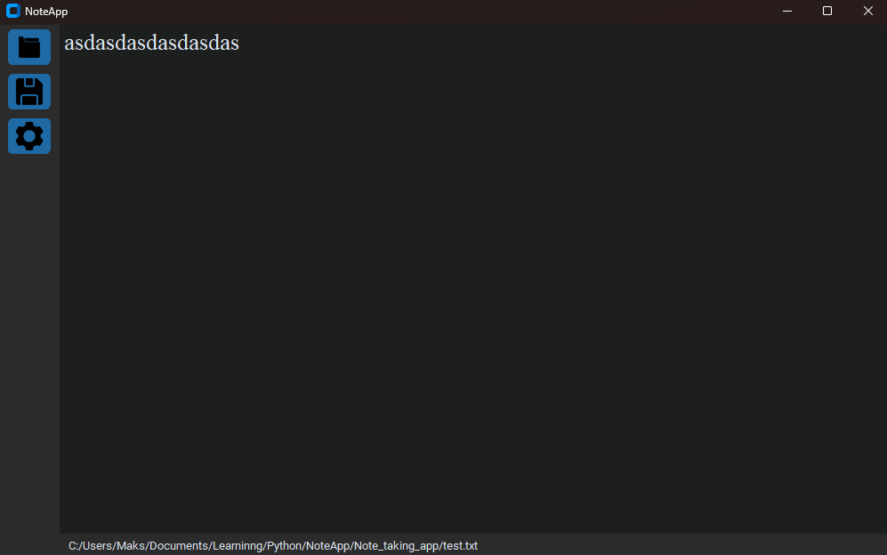
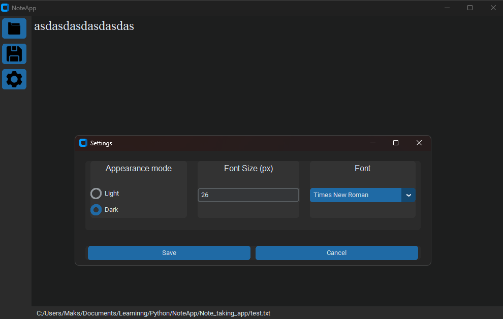

# Simple Note-Taking App (Python)

A basic note-taking desktop application built with **Python and CustomTkinter**.  
This is my **first Python project**, made to learn GUI programming, file handling, and python overall while building something useful.

## 📸 Screenshots

### Main Window

### Menu Buttons

Won't be improving it or anything.

Icons used in the buttons:
SaveIcon:Yogi Aprelliyanto
FolderIcon: Freepik
CogwheelIcon: PixelPerfect

